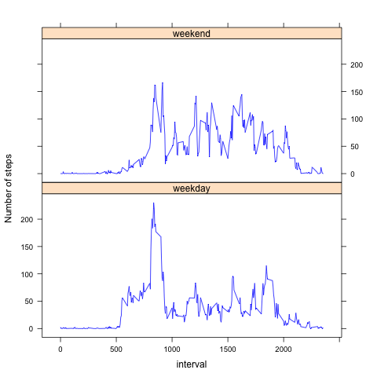

# Reproducible Research: Peer Assessment 1
Before using this markdown, fork and clone the data from https://github.com/Smendero/RepData_PeerAssessment1
- Set your working directory to the RepData_PeerAssessment1 folder
- unzip the activity.zip file

## Loading and preprocessing the data


```r
## load libraries
library(lattice)
## read in data
acDat <- read.csv("activity.csv", header=TRUE)

## transform the date data to date class
acDat$date <- as.Date(as.character(acDat$date), format= "%Y-%m-%d")
```


## What is mean total number of steps taken per day?

```r
## make a histogram of number of steps for each day
# get the number of steps per day
stepsSet<- split(acDat[,1], as.factor(acDat$date))
stepsDay <- sapply(stepsSet, sum, na.rm=TRUE)
png(file="figure/histogram.png")
plot <- hist(stepsDay, main="Histogram of steps per day", xlab="steps per day")
dev.off()
```

```
## quartz_off_screen 
##                 2
```

```r
## get mean and median of total steps taken perday
meansteps <- mean(stepsDay)
mediansteps <- median(stepsDay)
```

mean steps per day : 9354.2295082
median steps per day : 10395

## What is the average daily activity pattern?


```r
## get average steps per interval
intervalSet<- split(acDat[,1], as.factor(acDat$interval))
activityInt <- sapply(intervalSet, mean, na.rm=TRUE)
activityInt <- cbind(as.numeric(names(activityInt)), activityInt)
png(file="figure/activity_int.png")
plot(y=activityInt[,2], x=as.integer(activityInt[,1]), xlab= "interval", ylab= "average daily steps", main="Average daily pattern",  type="l")
dev.off()
```

```
## quartz_off_screen 
##                 2
```

```r
##find interval with maximum daily value
maxInt <- activityInt[activityInt[,2]==max(activityInt[,2]),1]
```

Interval with maximum daily value: 835

## Imputing missing values


```r
## find how many missing values
MissingDat <- sum(is.na(acDat$steps))

## make new dataset with filled missing values in dataset using the average
## daily steps for that interval
acDat2 <- acDat
for (i in 1:nrow(acDat2)){
        if(is.na(acDat2[i,]$steps)){
                acDat2[i,]$steps <- activityInt[activityInt[,1]==acDat2[i,]$interval,2]
        }
}

## make a histogram of number of steps for each day
# get the number of steps per day
stepsSet<- split(acDat2[,1], as.factor(acDat2$date))
stepsDay <- sapply(stepsSet, sum, na.rm=TRUE)
png(file="figure/histogram_filldata.png")
plot <- hist(stepsDay, main="Histogram of steps per day", xlab="steps per day")
dev.off()
```

```
## quartz_off_screen 
##                 2
```

```r
## get mean and median of total steps taken perday
newmeansteps <- mean(stepsDay)
newmediansteps <- median(stepsDay)

if(newmeansteps > meansteps){
        StepMeandiff <- "increased"
        meanBy <- newmeansteps - meansteps
} else if(newmeansteps < meansteps){
                StepMeandiff <- "decreased"
                meanBy <- meansteps - newmeansteps
} else {
                StepMeandiff <- "not changed"
                meanBy <- NULL
}

if(newmediansteps > mediansteps){
        StepMediandiff <- "increased"
        medianBy <- newmediansteps - mediansteps
} else if(newmediansteps < mediansteps){
                StepMediandiff <- "decreased"
                medianBy <- mediansteps - newmediansteps
} else {
                StepMediandiff <- "not changed"
                medianBy <- NULL
        }
```
Number of missing values in dataset: 2304

Mean of filled dataset: 1.0766189\times 10^{4}
Median of filled dataset: 10395

The replacement of NA values with daily step means for intervals has increased the daily mean 1411.959171.

The replacement of NA values with daily step means for intervals has increased the daily median 371.1886792.

## Are there differences in activity patterns between weekdays and weekends?


```r
## get new variable called wkday that has weekend and weekend levels
newnames <- c(colnames(acDat2), "wkday")
acDat2[,4] <- weekdays(acDat2$date)
colnames(acDat2) <- newnames
acDat2[acDat2$wkday %in% c("Monday", "Tuesday", "Wednesday", "Thursday", "Friday"),]$wkday <- "weekday"
acDat2[!acDat2$wkday == "weekday",]$wkday <- "weekend"
acDat2$wkday = as.factor(acDat2$wkday)

##get activity data for weekdays and weekends
wkwkend <- split(acDat2, acDat2$wkday)

intervalSetwk<- split(wkwkend[[1]]$steps, as.factor(wkwkend[[1]]$interval))
activityIntwk <- sapply(intervalSetwk, mean, na.rm=TRUE)
activityIntwk <- cbind(as.numeric(names(activityIntwk)), activityIntwk, "weekday")

intervalSetwkend<- split(wkwkend[[2]]$steps, as.factor(wkwkend[[2]]$interval))
activityIntwkend <- sapply(intervalSetwkend, mean, na.rm=TRUE)
activityIntwkend <- cbind(as.numeric(names(activityIntwkend)), activityIntwkend, "weekend")

Wkdaysactivity <- as.data.frame(rbind(activityIntwk, activityIntwkend))
colnames(Wkdaysactivity) <- c("interval", "avsteps", "wkday")
Wkdaysactivity$interval <- as.numeric(as.character(Wkdaysactivity$interval))
Wkdaysactivity$avsteps <- as.numeric(as.character(Wkdaysactivity$avsteps))

## make two panel plot with time series plots for weekends and weekdays
png(file="figure/activity_int_wkday.png")
xyplot(avsteps ~ interval|wkday, data = Wkdaysactivity, groups = wkday, xlab = "interval", ylab = "Number of steps", type="l", layout = c(1,2), col="blue")
dev.off()
```

```
## quartz_off_screen 
##                 2
```



